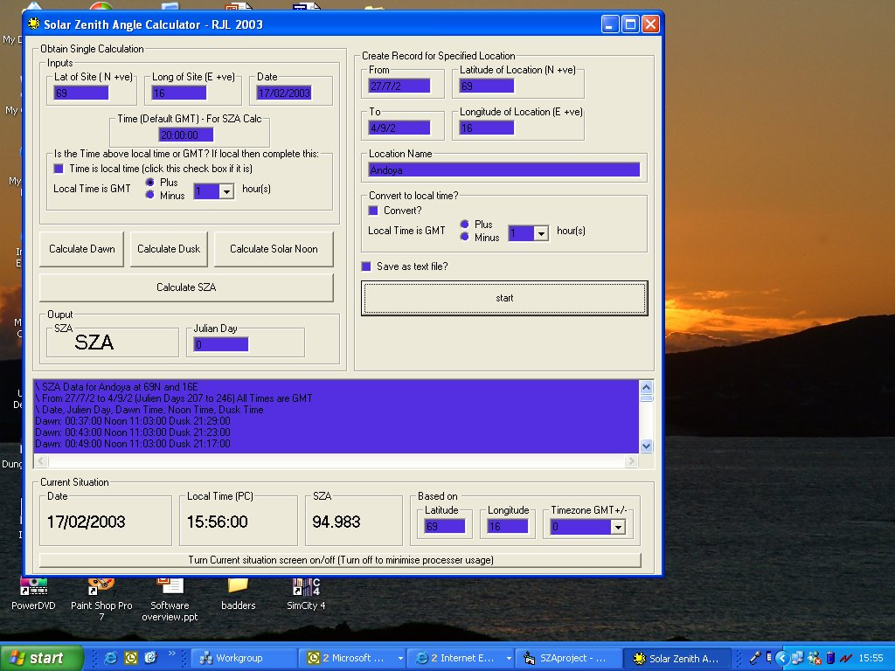



## Sun Elevation Calculator \(SZA\)

### Description

Calculates the Solar Zenith Angle for a given day, time, latitude and longitude. In other words, the elevation angle of the sun at a given time and place. Functionality is included for calculating Dawn, Dusk and Noon times for specified times or periods, and outputting to file.

I originally needed this for some atmospheric research I was doing, and I couldn't find any simple application on the web, so having eventually found the algorithm and coded it, I thought I'd make it into a little VB module, and application, which might be of use to the next person who needs to know how high the sun is.

The application includes examples of:

- Manipulation of Date and Time variables

- Use of Timers to run clocks and updating displays

- Simple outputting of data to screen

- Simple outputting of data to a text file

I hope it's helpful to someone out there :-)
 
### More Info
 
Date, Time, latitude, Longitude.

Nothing.. explanations in code.

Solar Zenith Angle (the angle between a line straight up, and a line to the sun)

             |
---                |---
**Submitted On**   |2003-02-19 04:17:04
**By**             |[Roland Leigh](https://github.com/Planet-Source-Code/PSCIndex/blob/master/ByAuthor/roland-leigh.md)
**Level**          |Intermediate
**User Rating**    |5.0 (15 globes from 3 users)
**Compatibility**  |VB 6\.0
**Category**       |[Math/ Dates](https://github.com/Planet-Source-Code/PSCIndex/blob/master/ByCategory/math-dates__1-37.md)
**World**          |[Visual Basic](https://github.com/Planet-Source-Code/PSCIndex/blob/master/ByWorld/visual-basic.md)
**Archive File**   |[Sun\_Elevat1546752192003\.zip](https://github.com/Planet-Source-Code/roland-leigh-sun-elevation-calculator-sza__1-43299/archive/master.zip)

